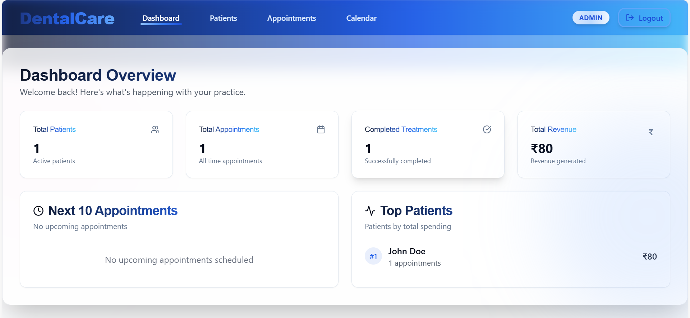
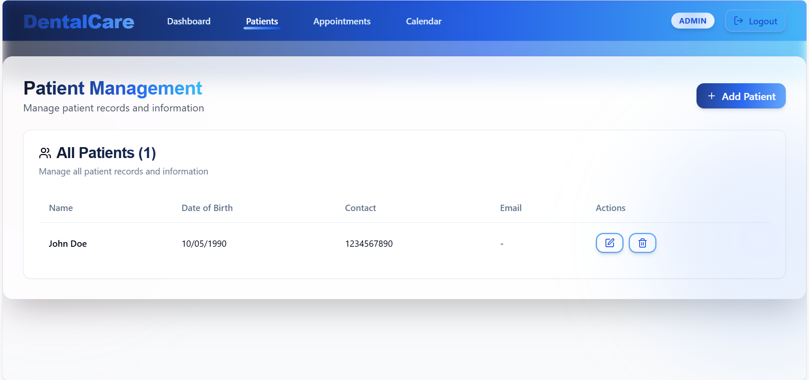
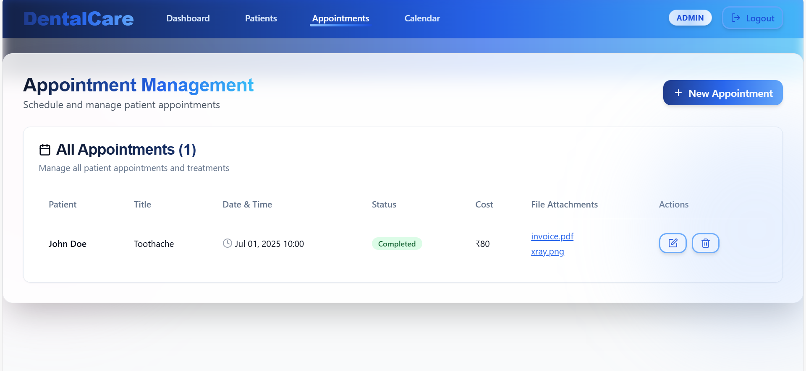
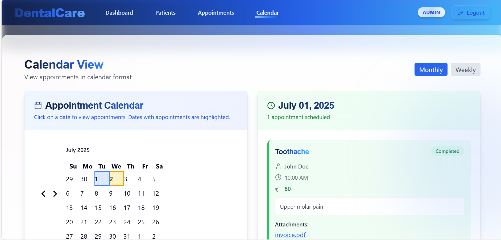
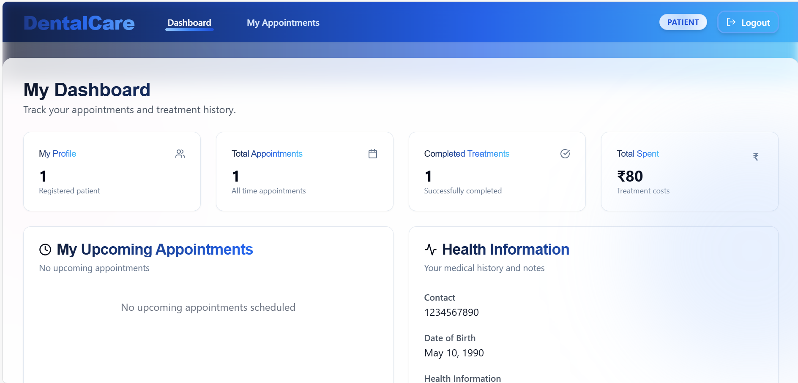
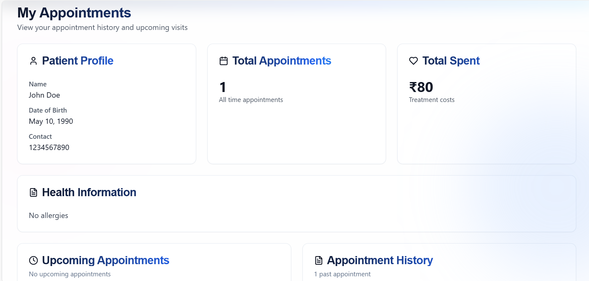

## ENTNT Dental Center Management Dashboard

A modern, fully responsive Dental Center Management Dashboard for ENTNT, built with React, TypeScript, and TailwindCSS.  
This application simulates a real-world dental clinic workflow, managing patients, appointments (incidents), and treatment records—all with localStorage persistence and no backend.

---

### 🚀 Live Demo

> **[https://dental-care-entnt.vercel.app/](https://dental-care-entnt.vercel.app/)**  

---

## Table of Contents

- [Features](#features)
- [Screenshots](#screenshots)
- [Architecture](#architecture)
- [Tech Stack](#tech-stack)
- [Setup & Installation](#setup--installation)
- [Usage Guide](#usage-guide)
- [Mock Data](#mock-data)
- [Technical Decisions](#technical-decisions)
- [Known Issues & Limitations](#known-issues--limitations)
- [Contact](#contact)

---

## Features

- **User Authentication (Simulated)**
  - Hardcoded users (Admin/Dentist & Patient)
  - Login with email/password
  - Session persistence via localStorage
  - Role-based access control

- **Patient Management (Admin-only)**
  - View, add, edit, delete patients
  - Store full name, DOB, contact, health info

- **Appointment / Incident Management (Admin-only)**
  - Manage multiple incidents per patient
  - Track title, description, comments, appointment datetime
  - After appointment: add cost, treatment, status, next date, and upload files (invoices, images)

- **Calendar View (Admin-only)**
  - Monthly/weekly view of appointments
  - Click a day to see scheduled treatments

- **Dashboard (Landing Page)**
  - KPIs: next 10 appointments, top patients, pending/completed treatments, revenue, etc.

- **Patient View (Patient role)**
  - View own data, upcoming appointments, history, costs, treatments, and file attachments

- **Data Persistence**
  - All data stored in localStorage
  - File uploads saved as base64 or blob URLs

- **Responsive Design**
  - Fully responsive across devices

---

## Screenshots

### 👨‍⚕️ **Admin Dashboard**

*The main admin dashboard provides a comprehensive overview of the dental practice. Features include:*
- **Key Performance Indicators**: Total patients, appointments, revenue, and treatment statistics
- **Upcoming Appointments**: Next 10 scheduled appointments with patient details
- **Top Patients**: Most active patients with appointment counts and spending
- **Quick Actions**: Easy access to add new patients and appointments
- **Revenue Analytics**: Visual charts showing monthly revenue trends

### 👥 **Patient Management**

*Complete patient record management system with:*
- **Patient Directory**: Searchable list of all registered patients
- **Add/Edit Patients**: Form to create and update patient profiles
- **Patient Details**: Full information including contact, DOB, and health history
- **Quick Actions**: Edit and delete patient records
- **Responsive Design**: Works seamlessly on desktop and mobile devices

### 📅 **Appointment Management**

*Comprehensive appointment scheduling and tracking system featuring:*
- **Appointment List**: All scheduled appointments with patient details
- **Add New Appointments**: Form to schedule appointments with file uploads
- **Status Tracking**: Monitor appointment status (Scheduled, In Progress, Completed, Cancelled)
- **Treatment Records**: Add costs, treatments, and follow-up dates
- **File Attachments**: Upload invoices, X-rays, and treatment documents

### 🗓️ **Calendar View**

*Visual calendar interface for appointment management:*
- **Monthly/Weekly Views**: Toggle between different calendar perspectives
- **Appointment Visualization**: Color-coded appointments by status
- **Day Details**: Click any date to see scheduled appointments
- **Quick Navigation**: Easy month/week navigation
- **Appointment Details**: View full appointment information and patient details

### 👤 **Patient Dashboard**

*Personalized dashboard for patients showing:*
- **Personal Stats**: Total appointments and amount spent on treatments
- **Profile Information**: Personal details and contact information
- **Health Information**: Medical history and treatment preferences
- **Quick Overview**: Summary of upcoming and past appointments

### 📋 **My Appointments (Patient View)**

*Patient's personal appointment management interface:*
- **Upcoming Appointments**: Future appointments with dates, times, and treatment details
- **Appointment History**: Complete record of past treatments and costs
- **Treatment Details**: View treatment plans, costs, and attached documents
- **File Access**: Download invoices, X-rays, and treatment records
- **Status Tracking**: Monitor appointment status and progress

---

## Architecture

```
src/
  components/      # Reusable UI and layout components
    ui/            # Buttons, cards, dialogs, tables, etc.
  pages/           # Main application pages (Dashboard, Calendar, etc.)
  contexts/        # React Contexts for global state (Auth)
  hooks/           # Custom React hooks (auth, toast, mobile)
  utils/           # Utility functions (localStorage, helpers)
  types/           # TypeScript interfaces and types
  App.tsx          # Main app component
  main.tsx         # Entry point
```

- **State Management**: React Context API for authentication, custom hooks for logic, local state for forms.
- **Routing**: React Router for navigation and protected routes.
- **Styling**: TailwindCSS for utility-first, responsive design.

---

## Tech Stack

- **React** (with functional components & hooks)
- **TypeScript**
- **React Router**
- **TailwindCSS**
- **LocalStorage** (for all data persistence)
- **Vite** (for fast development/build)

---

## Setup & Installation

1. **Clone the repository**
   ```bash
   git clone https://github.com/Prudvi337/Dental-Care.git
   cd Dental-Care
   ```

2. **Install dependencies**
   ```bash
   npm install
   ```

3. **Run the app locally**
   ```bash
   npm run dev
   ```

4. **Build for production**
   ```bash
   npm run build 
   ```

5. **Preview production build**
   ```bash
   npm run preview
   ```

---

## Usage Guide

### User Roles

- **Admin (Dentist)**
  - Email: `admin@entnt.in`
  - Password: `admin123`
  - Full access to all features

- **Patient**
  - Email: `john@entnt.in`
  - Password: `patient123`
  - Can only view their own data and appointments

### Main Features

- **Login**: Enter email and password to access the dashboard.
- **Dashboard**: View KPIs and quick stats.
- **Patient Management**: (Admin) Add, edit, delete, and view patients.
- **Appointment Management**: (Admin) Schedule, update, and track incidents for each patient.
- **Calendar**: (Admin) Visualize appointments by month/week.
- **Patient View**: (Patient) See upcoming and past appointments, treatments, and files.

---

## Mock Data

All data is initialized in localStorage on first load.  
Example structure:

### Users

* **Admin**

  * ID: `1`
  * Email: `admin@entnt.in`
  * Password: `admin123`

* **Patient**

  * ID: `2`
  * Email: `john@entnt.in`
  * Password: `patient123`
  * Patient ID: `p1`

---

### Patients

* **John Doe**

  * ID: `p1`
  * Date of Birth: `1990-05-10`
  * Contact: `1234567890`
  * Health Info: `No allergies`

---

### Incidents

* **Toothache**

  * ID: `i1`
  * Patient ID: `p1`
  * Description: `Upper molar pain`
  * Comments: `Sensitive to cold`
  * Appointment Date: `2025-07-01T10:00:00`
  * Cost: `$80`
  * Status: `Completed`
  * Files:

    * `invoice.pdf` (URL: base64string-or-blob-url)
    * `xray.png` (URL: base64string-or-blob-url)

---

## Technical Decisions

- **No backend**: All data is simulated and persisted in localStorage.
- **No external auth/data libraries**: Authentication and data management are fully custom.
- **TypeScript**: Ensures type safety and maintainability.
- **Context API**: Chosen for simple, scalable state management.
- **TailwindCSS**: Enables rapid, consistent, and responsive UI development.
- **Reusable Components**: UI and logic are modular for scalability and maintainability.

---

## Known Issues & Limitations

- Data is not shared across browsers/devices (localStorage only).
- No real backend or API integration.
- File uploads are stored as base64/blob URLs, not actual files.
- No password reset or user registration (hardcoded users only).
- Minimal accessibility testing (can be improved).

---
## Contact

For questions or support, contact:  
**Prudvi Kumar Reddy** – [prudvireddy7733@gmail.com](mailto:prudvireddy773@gmail.com) | [LinkedIn](https://www.linkedin.com/in/prudvi-kumar-reddy-5679662a5/) | [Portfolio](https://prudvi-kumar-reddy.vercel.app/)

---